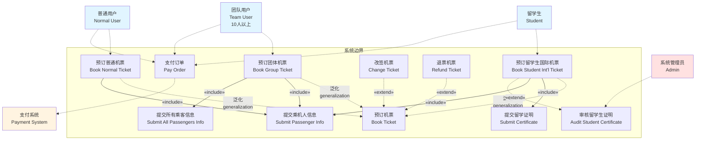
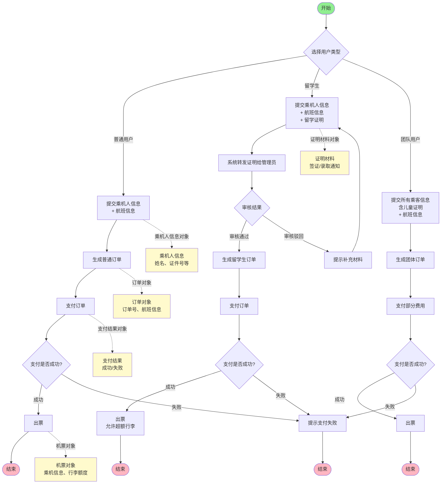
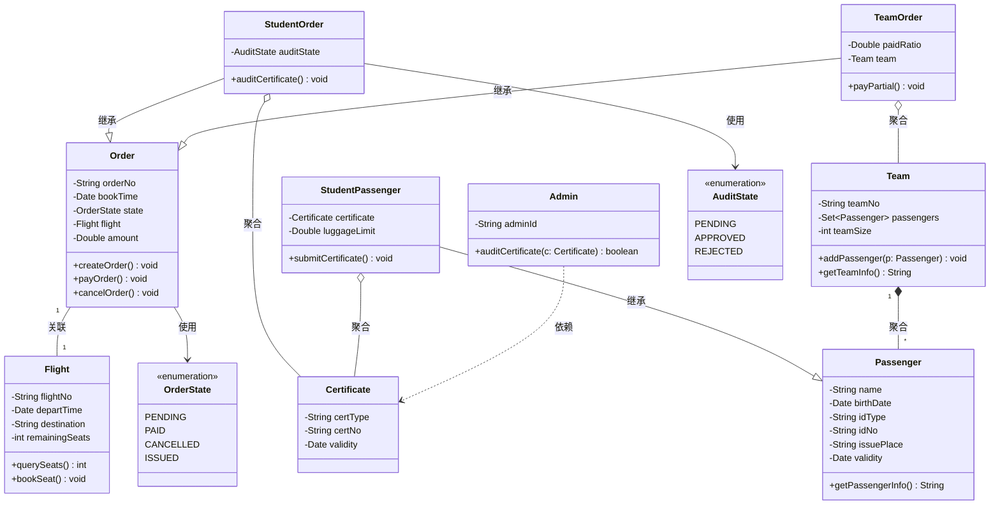
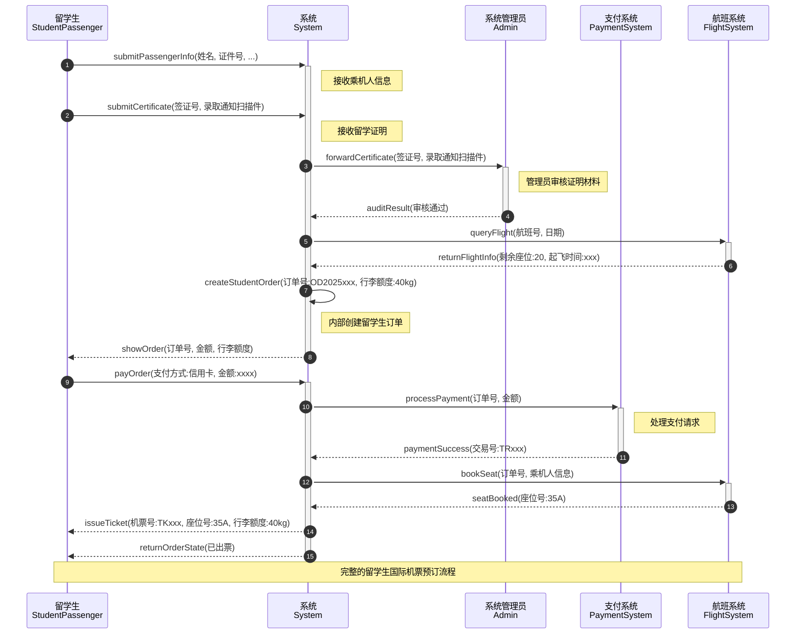

# 特殊机票预订系统 - UML建模文档

本文档包含特殊机票预订系统的完整UML建模，使用Mermaid语法绘制。

---

## 一、用例图（Use Case Diagram）

**说明：**
- 核心参与者：留学生、团队用户（10人以上）、普通用户
- 辅助参与者：系统管理员、支付系统
- 泛化关系：三种预订方式都是"预订机票"的特化
- 包含关系：预订时必须提交信息，留学生必须提交证明
- 扩展关系：改签和退票是预订成功后的可选操作；留学生预订需要审核

---

## 二、活动图（Activity Diagram）

**说明：**
- 控制流：展示了三种用户类型的完整预订流程
- 对象流：标注了流程中产生的关键对象（乘机人信息、证明材料、订单、支付结果、机票）
- 判断节点：审核结果、支付成功与否
- 循环：审核驳回时回退到提交证明环节

---

## 三、类图（Class Diagram）

**说明：**
- 继承关系：StudentPassenger继承Passenger；StudentOrder和TeamOrder继承Order
- 关联关系：Order与Flight一对一关联；Team与Passenger一对多关联
- 聚合关系：TeamOrder包含Team；StudentOrder包含Certificate
- 依赖关系：Admin审核依赖Certificate
- 枚举类型：OrderState和AuditState定义订单状态

---

## 四、序列图（Sequence Diagram）

**场景：留学生国际机票预订完整流程**

**说明：**
- 交互对象：留学生、系统、管理员、支付系统、航班系统
- 消息类型：同步调用（实线箭头）、返回值（虚线箭头）
- 关键步骤：
  1. 提交乘机人信息和留学证明
  2. 管理员审核证明
  3. 查询航班信息
  4. 创建留学生订单（40kg行李额度）
  5. 支付订单
  6. 预订座位并出票

---

## 五、状态图（State Diagram）

**对象：订单（Order）的生命周期**

```mermaid
stateDiagram-v2
    [*] --> 待提交: 创建订单
    
    %% 留学生订单专属审核流程
    待提交 --> 待审核: 提交留学证明<br/>(留学生订单专属)
    待审核 --> 审核通过: 管理员审核通过
    待审核 --> 审核驳回: 管理员审核驳回
    审核驳回 --> 待提交: 补充证明材料
    
    %% 支付流程
    待提交 --> 待支付: 生成订单
    审核通过 --> 待支付: 生成订单
    
    待支付 --> 部分支付: 支付部分费用<br/>(团体订单专属)
    待支付 --> 已支付: 全额支付
    待支付 --> 已取消: 用户取消预订/<br/>超时未支付
    已取消 --> [*]: 订单结束
    
    %% 出票流程
    部分支付 --> 已出票: 航班系统确认出票
    已支付 --> 已出票: 航班系统确认出票
    
    %% 改签流程
    已出票 --> 待改签: 用户申请改签<br/>(约束: 改签次数≤2)
    待改签 --> 改签中: 系统处理改签
    改签中 --> 已改签: 改签完成
    已改签 --> 已出票: 返回出票状态
    改签中 --> 改签失败: 无剩余座位
    改签失败 --> 已出票: 返回原票状态
    
    %% 退票流程
    已出票 --> 待退票: 用户申请退票
    待退票 --> 已退票: 系统处理退票
    已退票 --> [*]: 订单结束
    待退票 --> 退票失败: 超退票时限
    退票失败 --> 已出票: 返回原票状态
    
    %% 状态注释
    note right of 待审核
        留学生订单需要管理员
        审核留学证明材料
    end note
    
    note right of 部分支付
        团体订单可以先支付
        部分费用再出票
    end note
    
    note right of 待改签
        改签次数限制≤2次
        改签失败返回原状态
    end note
    
    note right of 待退票
        超过退票时限则失败
        返回已出票状态
    end note
```

**说明：**
- 初始状态：待提交
- 核心状态转换：
  - 待提交 → 待审核（留学生订单）→ 审核通过/审核驳回
  - 待提交/审核通过 → 待支付 → 已支付/部分支付
  - 已支付/部分支付 → 已出票
  - 已出票 → 待改签 → 改签中 → 已改签/改签失败
  - 已出票 → 待退票 → 已退票/退票失败
- 终态：已取消、已退票
- 特殊约束：
  - 改签次数≤2
  - 团体订单可部分支付
  - 留学生订单需审核

---

## 六、总结

本文档完整描述了特殊机票预订系统的UML建模，包括：

1. **用例图**：展示了系统的功能需求和参与者交互
2. **活动图**：展示了三种用户类型的完整预订流程（控制流和对象流）
3. **类图**：展示了系统的静态结构和类之间的关系
4. **序列图**：展示了留学生国际机票预订的完整交互过程
5. **状态图**：展示了订单对象的完整生命周期

所有图表均使用Mermaid语法编写，可直接在支持Mermaid的Markdown查看器中渲染显示。

---

## 附录：关键业务规则

1. **留学生特权**：
   - 需提交留学证明（签证/录取通知）
   - 管理员审核通过后方可预订
   - 享有超额行李额度（40kg）

2. **团体订单特点**：
   - 10人以上团队用户
   - 需提交所有乘客信息（含儿童证明）
   - 支持部分支付

3. **订单操作规则**：
   - 改签次数限制≤2次
   - 退票有时限限制
   - 支付超时自动取消

4. **系统参与者**：
   - 核心参与者：留学生、团队用户、普通用户
   - 辅助参与者：系统管理员、支付系统
